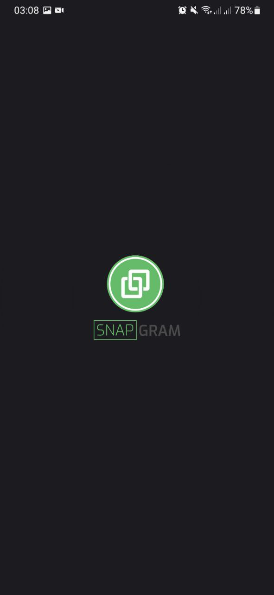
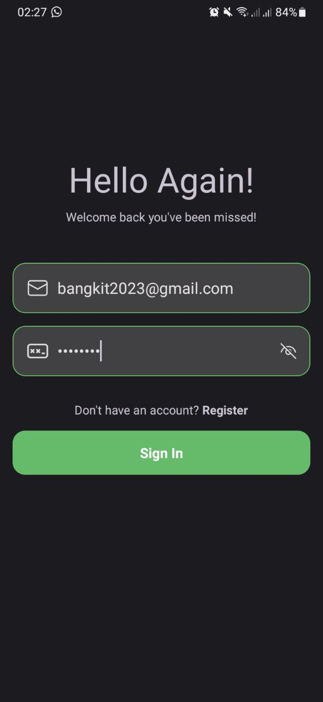
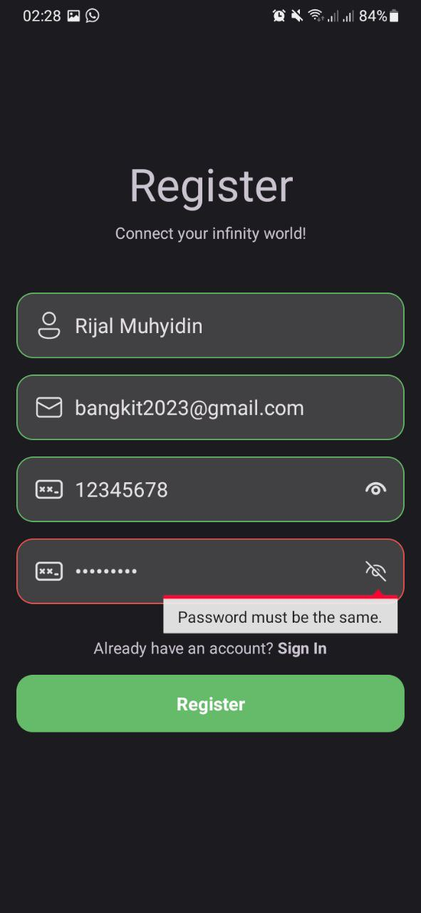
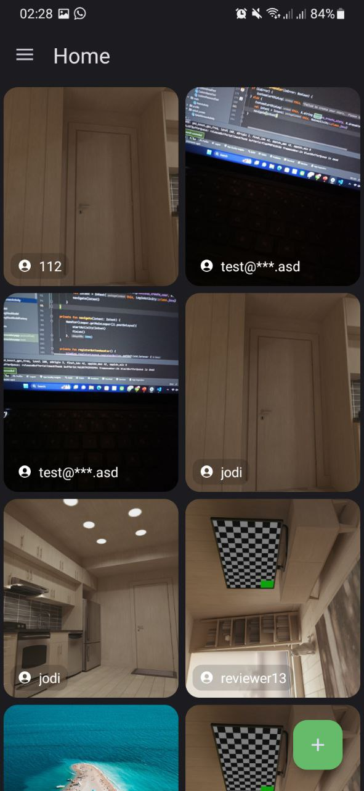
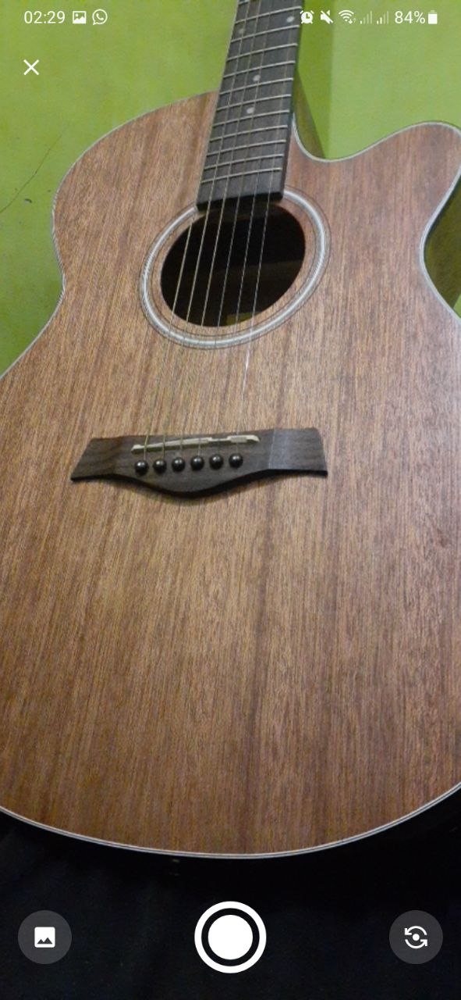
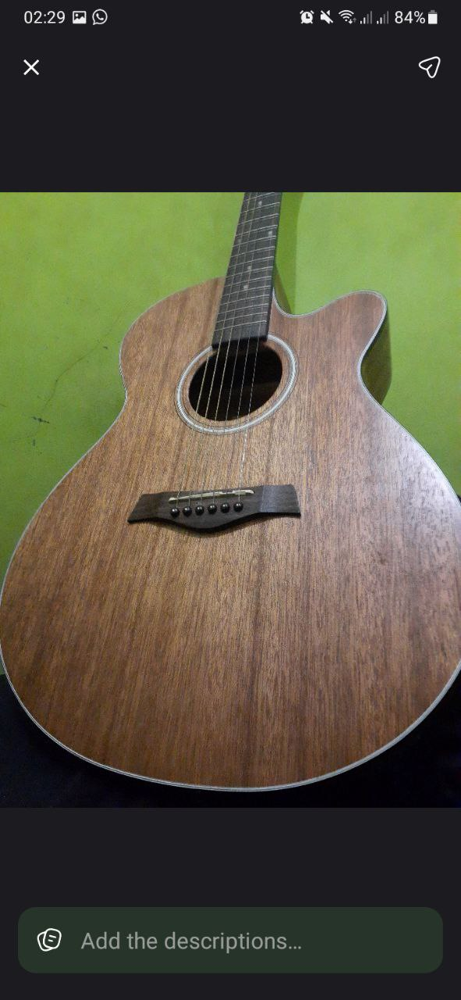
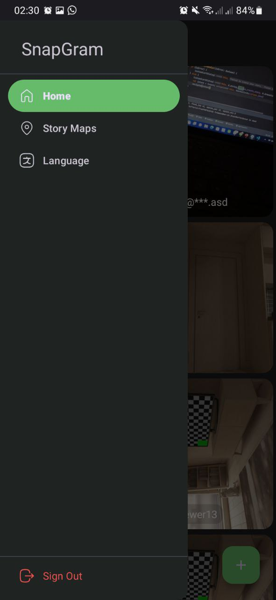
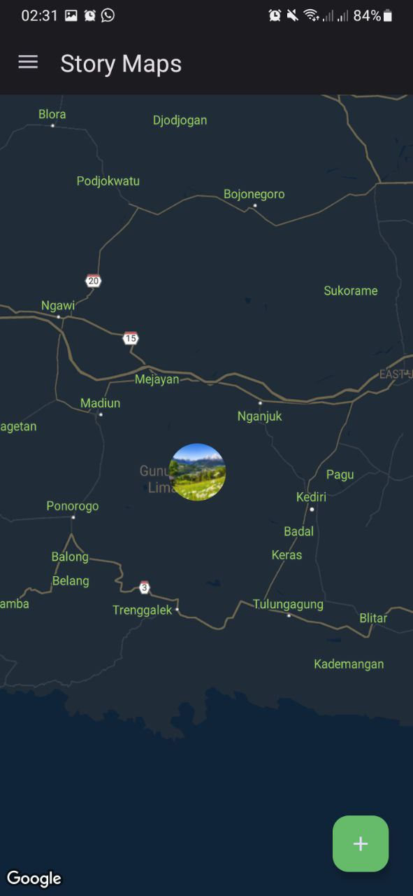
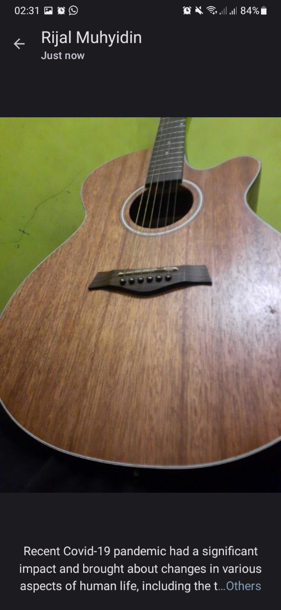
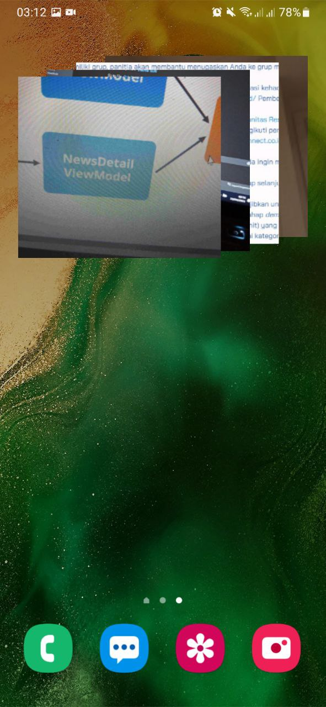

# SnapGram
Belajar Pengembangan Aplikasi Android Intermediate Dicoding Academy Submission

> **Warning**
> IF YOU ARE DOING ON THE SAME SUBMISSION, PLEASE USE THIS AS A REFERENCE. PLEASE DON'T COPY PASTE!

## Local Configurations (local.properties) :
```
BASE_URL=https://story-api.dicoding.dev/v1/
MAPS_API_KEY=(Your Maps API Key here starts with Aiza)
```
[See this](https://developers.google.com/maps/documentation/android-sdk/get-api-key?hl=id) 

## Screenshots :
<table>
   <tr>
      <td></td>
      <td></td>
      <td></td>
   </tr> 
   <tr>
      <td></td>
      <td></td>
      <td></td>
  </tr>
  <tr>
      <td></td>
      <td></td>
      <td></td>
  </tr>
  <tr>
      <td></td>
  </tr>
</table>
